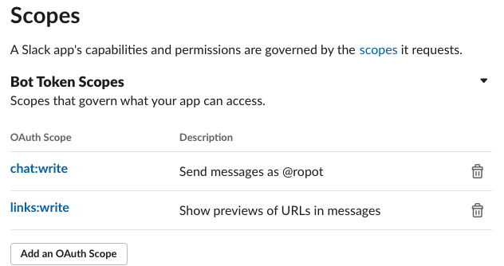

## Table of contents
* <a href="https://github.com/sshantel/craigslist-ropot#-about-"> About
* <a href="https://github.com/sshantel/craigslist-ropot#-installation-"> Installation
* <a href="https://github.com/sshantel/craigslist-ropot#-external-setup-"> External Setup


<h5> About </h5>

Utilizes Python Requests and Beautiful Soup libraries to scrape Craigslist postings by keyword search. Listings are written to CSV, and posted to a Slack channel with Slack’s API. Deployed on Heroku’s Cloud service.

<h4> Installation </h4>
<br>
You must have the following installed to run Craigslist-Ropot:
  
Slack 
<br>
Python3 
<br>
Requests Library 
<br>

 
 <h4> External Setup </h4>


* Slack <a href="https://slack.com/create#email"> workspace </a> 
* An <a href= "https://api.slack.com/apps"> App </a> on your workspace  
* Add `chat:write`  `links:write` OAuth Token scopes under Add Features and Functionality --> Permissions:

* Install App to workspace
* Channel for bot to post into
* Add bot to channel

* Store Slack API in secrets.sh file: ```export SLACK_API_TOKEN='INSERT-TOKEN-HERE'```

<b> Running Ropot-Planter on your computer </b>

1. Clone or fork repository:

```
$ git clone https://github.com/sshantel/craigslist-ropot
```

2. If you don't want to search for planters for sale in the SF Bay Area, you'll need to update the ```region``` and ```term```  in line 149 of ```scraper.py``` to fit your desired needs. The URL in line 37 can be adjusted according to what you want to scrape on Craigslist as well.


<h4> Deployment </h4>